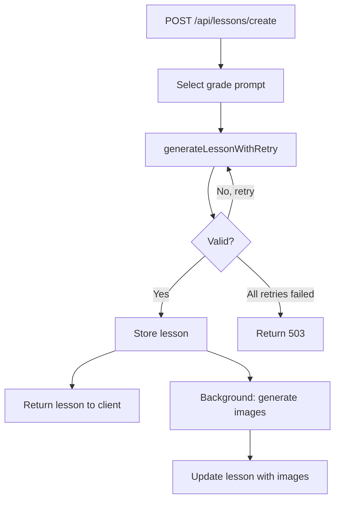

## Overview

When a learner requests a lesson, the pipeline:

1. Selects grade-appropriate prompt templates
2. Calls the AI to generate structured lesson content
3. Validates the output (rejects stubs and placeholders)
4. Stores the lesson with `ACTIVE` status
5. Kicks off background image generation



## Generation

`generateLessonWithRetry()` in `server/services/enhanced-lesson-service.ts` is the single entry point for all lesson generation. It:

1. Builds a prompt using grade-specific templates from `server/prompts/grades/`
2. Calls the AI via OpenRouter (or Bittensor fallback)
3. Parses the response into an `EnhancedLessonSpec`
4. Validates with `validateLessonSpec()`
5. Retries up to 3 times on failure

## Validation

`validateLessonSpec()` in `server/services/lesson-validator.ts` checks:

- **Has a title** — Non-empty string
- **Has sections** — At least 2 content sections
- **Has questions** — At least 2 quiz questions
- **No placeholder content** — Rejects patterns like "This is a lesson about"
- **Valid questions** — Each question has 2+ options and a valid `correctIndex`

If validation fails, the lesson is not stored. If all 3 retry attempts fail, the API returns `503 Service Unavailable`.

## Storage

Lessons use a single `spec` column containing the full `EnhancedLessonSpec`:

```typescript
interface EnhancedLessonSpec {
  title: string;
  sections: Array<{
    title: string;
    content: string;
    imagePrompt?: string;
  }>;
  questions: Array<{
    question: string;
    options: string[];
    correctIndex: number;
    explanation?: string;
    conceptTags?: string[];
  }>;
  images?: Array<{
    id: string;
    svgData?: string;
    base64Data?: string;
    path?: string;
    description: string;
  }>;
  diagrams?: Array<{
    id: string;
    svgData?: string;
    title: string;
    description: string;
    type: string;
  }>;
}
```

The database enforces `idx_one_active_per_learner` — each learner can only have one `ACTIVE` lesson. Creating a new lesson automatically retires the previous one.

## Background image generation

After the lesson is stored and returned to the client:

1. A background task calls `generateLessonImages()` from `server/services/image-generation-router.ts`
2. Images and diagrams are generated via the SVG LLM service (default) or OpenRouter
3. The lesson's `spec` is updated with the generated images
4. The client polls via `refetchInterval` until images arrive (every 5 seconds)

This approach returns the lesson text immediately without waiting for image generation.
